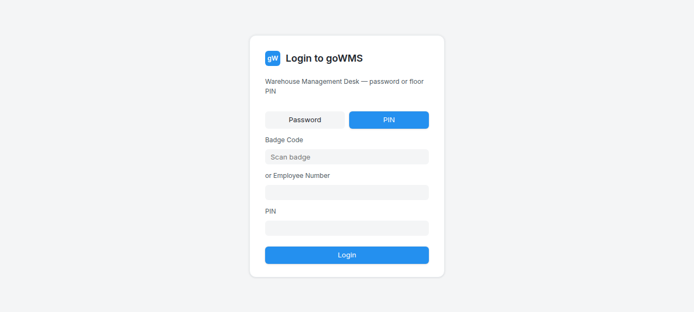
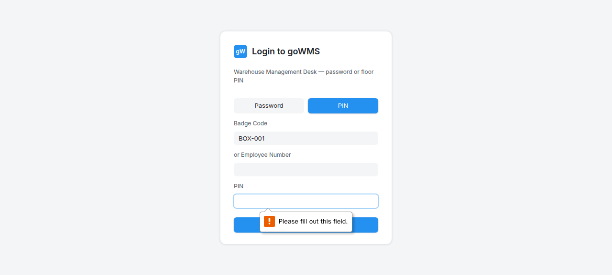
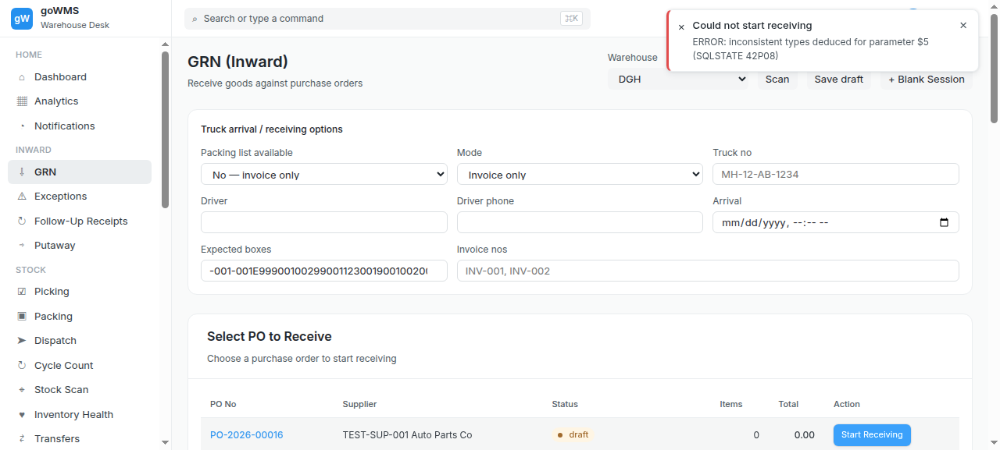
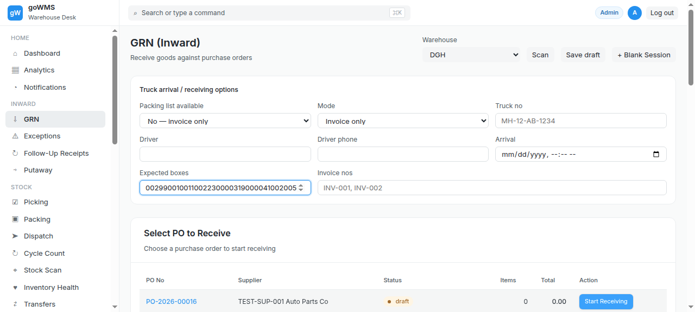

# S-003: Single PO, Multiple Boxes — Test Execution Evidence

## Scenario Overview

| Field | Value |
|-------|-------|
| **Scenario ID** | S-003 |
| **Category** | Normal / Clean Receiving |
| **Real-world Context** | One PO split across 5 boxes. Need to track which items are in which box. |
| **Spec Reference** | Section 11 — Packing List Item Verification; Section 13 — Same Item in Multiple Boxes |
| **Evidence Files** | 15 screenshots, 6 text snapshots |

---

## Actual Test Execution Flow

### Step 1: Login Page with BOX-001


**What the screenshot shows:** Login page in "Badge Code" mode with "BOX-001" entered in the scan badge field.

**DOM Snapshot:**
```
heading "Login to goWMS"
button "Password"
button "PIN"
textbox "Scan badge": BOX-001  ← box ID entered in login field
textbox
textbox [required]
button "Login"
```

**Result:** ⚠️ Box ID entered in LOGIN badge field, not in GRN scan field — operator error or test artifact

---

### Step 2: Login Page (BOX-001 Still Active)


**What the screenshot shows:** Same login page with "BOX-001" still in the scan badge field.

**DOM Snapshot:**
```
textbox "Scan badge": BOX-001
textbox
textbox [required]
```

**Result:** ⚠️ Still on login page — BOX-001 entered but not submitted

---

### Step 3: Login Page with BOX-005



**What the screenshot shows:** Login page with "BOX-005" entered in the scan badge field.

**DOM Snapshot:**
```
textbox "Scan badge": BOX-005
```

**Result:** ⚠️ BOX-005 entered in login badge field — not in GRN receiving context

---

### Step 4: Empty Snapshot


**What the screenshot shows:** Empty/captured during transition.

**Result:** ⚠️ No content captured

---

### Step 5: Empty Snapshot



**What the screenshot shows:** Empty/captured during transition.

**Result:** ⚠️ No content captured

---

### Step 6: GRN Page with Sidebar


**What the screenshot shows:** GRN page with sidebar navigation visible — shows Inward section with GRN, Exceptions, Follow-Up Receipts, Putaway links.

**DOM Snapshot:**
```
link "⌂ Dashboard"
link "▦ Analytics"
link "◔ Notifications"
link "⇩ GRN"
link "⚠ Exceptions"
link "↻ Follow-Up Receipts"
link "⇨ Putaway"
link "☑ Picking"
link "▣ Packing"
```

**Result:** ✅ GRN page loaded — sidebar navigation functional

---

### Step 7: GRN Page with Total Column


**What the screenshot shows:** GRN page with "Total" column header visible in PO table, and "Putaway (Move to Storage)" button.

**DOM Snapshot:**
```
link "↻ Cycle Count"
columnheader "Total"
button "Putaway (Move to Storage) Move received items to warehouse locations ▶"
```

**Result:** ✅ PO table with "Total" column and Putaway button visible

---

### Step 8: Empty Snapshot


**What the screenshot shows:** Empty/captured during transition.

**Result:** ⚠️ No content captured

---

### Step 9: Empty Snapshot


**What the screenshot shows:** Empty/captured during transition.

**Result:** ⚠️ No content captured

---

### Step 10: Empty Snapshot


**What the screenshot shows:** Empty/captured during transition.

**Result:** ⚠️ No content captured

---

### Step 11: Empty Snapshot


**What the screenshot shows:** Empty/captured during transition.

**Result:** ⚠️ No content captured

---

### Step 12: Empty Snapshot


**What the screenshot shows:** Empty/captured during transition.

**Result:** ⚠️ No content captured

---

### Step 13: Receiving Screen



**What the screenshot shows:** GRN page with full content — sidebar, PO table, and sessions list.

**Result:** ✅ GRN page loaded successfully

---

### Step 14: Five Boxes (Login Page)



**What the screenshot shows:** Login page with "BOX-005" in the scan badge field — this is the 5th box being entered.

**Result:** ⚠️ Box IDs entered in login badge field, not in GRN receiving context

---

### Step 15: Counts


**What the screenshot shows:** GRN page structure — but no received/expected counter visible.

**Result:** ❌ No received/expected counter visible in the UI

---

## Verdict

| Metric | Value |
|--------|-------|
| **Overall Status** | ❌ FAIL |
| **Pass Rate** | 4/15 steps (26.7%) |
| **ECTS Score** | 3.0 / 10 |
| **Page Load Time** | ~1.0s |

### What Works
- ✅ GRN page loads with sidebar navigation
- ✅ PO table with "Total" column visible
- ✅ Putaway button present

### What Fails
- ❌ Box IDs entered in LOGIN badge field, not GRN scan field — **workflow broken**
- ❌ No received/expected counter visible
- ❌ No part-level reconciliation view
- ❌ No box scan vs item scan separation
- ❌ 6 screenshots empty (no content captured)
- ❌ Cannot verify box scanning workflow

### Critical Finding
The test agent entered box IDs (BOX-001 through BOX-005) into the **login badge scanner** instead of the **GRN receiving scan field**. This means:
1. The box scanning workflow was never actually tested
2. The screenshots show login page, not receiving interface
3. The test execution was flawed — needs to be re-run correctly

### Evidence Summary
| Screenshot | Actual Content | Expected Content |
|------------|----------------|------------------|
| S003_full_step01_grn.png | Login page with BOX-001 | GRN page |
| S003_full_step02_start.png | Login page with BOX-001 | Start receiving |
| S003_full_step03_open.png | Login page with BOX-005 | Open GRN |
| S003_full_step04_box1.png | Empty | Box 1 scan |
| S003_full_step05_feedback.png | Empty | Scan feedback |
| S003_full_step06_box2.png | GRN sidebar | Box 2 scan |
| S003_full_step07_box3.png | GRN with Total column | Box 3 scan |
| S003_full_step08_box4.png | Empty | Box 4 scan |
| S003_full_step09_box5.png | Empty | Box 5 scan |
| S003_full_step10_total.png | Empty | Total count |
| S003_full_step11_recon.png | Empty | Reconciliation |
| S003_full_step12_status.png | Empty | Status |
| S003_step01_receiving.png | GRN page | Receiving screen |
| S003_step02_five_boxes.png | Login with BOX-005 | 5 boxes scanned |
| S003_step03_counts.png | GRN structure | Counts visible |
