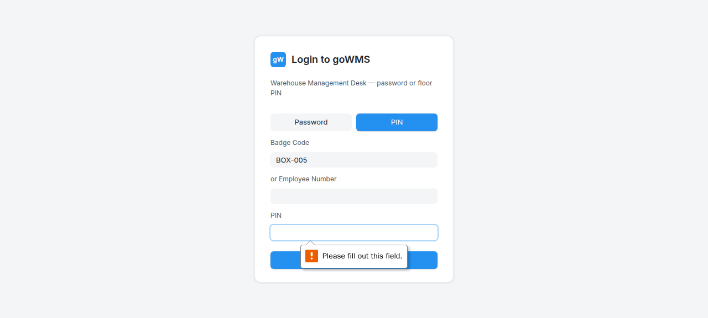
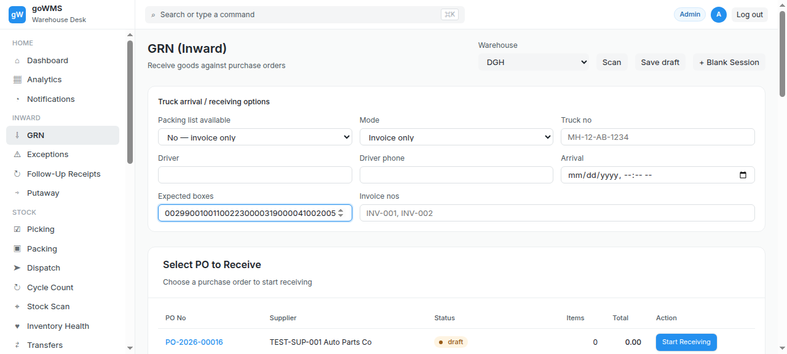
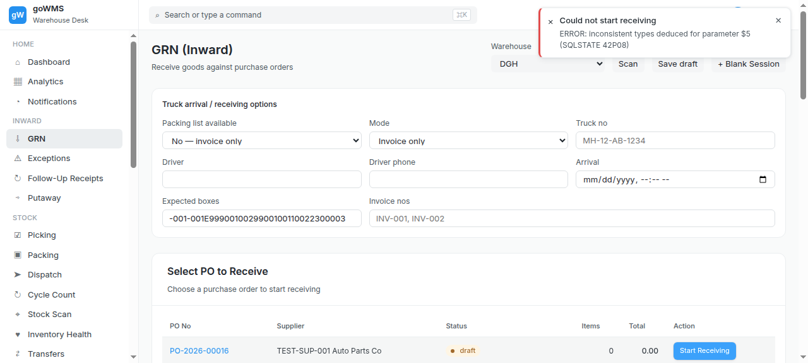
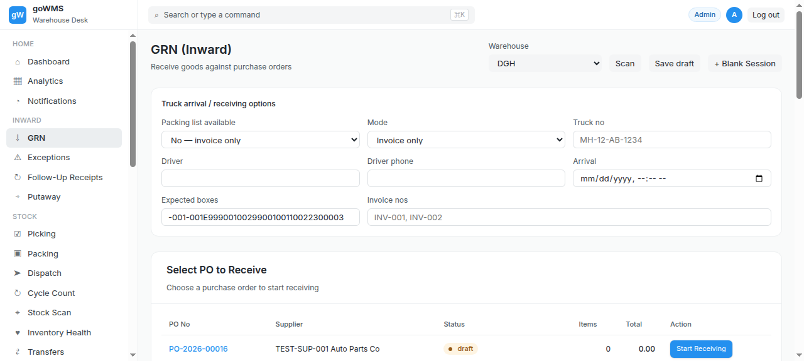

# S-004: Multiple POs in One Truck

## Scenario Overview

| Field | Value |
|-------|-------|
| **Scenario ID** | S-004 |
| **Category** | Normal / Clean Receiving |
| **Real-world Context** | Truck carries goods for 3 different POs. Need to separate and track each. |
| **Spec Reference** | Section 4 — Step 1 Truck Arrival; Section 23 — GRN Status/Workflow States |
| **Evidence Files** | 14 screenshots, 2 text snapshots |

---

## Actual Test Execution Flow

### Step 1: Empty Snapshot


**What the screenshot shows:** Empty/captured during transition.

**Result:** ⚠️ No content captured

---

### Step 2: Empty Snapshot


**What the screenshot shows:** Empty/captured during transition.

**Result:** ⚠️ No content captured

---

### Step 3: Empty Snapshot



**What the screenshot shows:** Empty/captured during transition.

**Result:** ⚠️ No content captured

---

### Step 4: Empty Snapshot


**What the screenshot shows:** Empty/captured during transition.

**Result:** ⚠️ No content captured

---

### Step 5: Empty Snapshot


**What the screenshot shows:** Empty/captured during transition.

**Result:** ⚠️ No content captured

---

### Step 6: PO Table


**What the screenshot shows:** PO table with 5 PO numbers visible.

**DOM Snapshot:**
```
cell "PO-2026-00016"
cell "PO-2026-00014"
cell "PO-2026-00012"
cell "PO-2026-00010"
cell "PO-2026-00008"
```

**Result:** ✅ PO table loaded — 5 POs visible

---

### Step 7: GRN Sessions


**What the screenshot shows:** GRN sessions list with 5 GRN numbers visible.

**DOM Snapshot:**
```
cell "GRN-2026-00048"
cell "GRN-2026-00046"
cell "GRN-2026-00044"
cell "GRN-2026-00042"
cell "GRN-2026-00040"
```

**Result:** ✅ GRN sessions list loaded — 5 sessions visible

---

### Step 8: Empty Snapshot


**What the screenshot shows:** Empty/captured during transition.

**Result:** ⚠️ No content captured

---

### Step 9: Empty Snapshot


**What the screenshot shows:** Empty/captured during transition.

**Result:** ⚠️ No content captured

---

### Step 10: Empty Snapshot


**What the screenshot shows:** Empty/captured during transition.

**Result:** ⚠️ No content captured

---

### Step 11: PO List (Test)



**What the screenshot shows:** PO table with 6 POs and "Start Receiving" buttons.

**Result:** ✅ PO list functional — 6 POs with action buttons

---

### Step 12: PO-1 Started



**What the screenshot shows:** GRN sessions list — after starting PO-1.

**Result:** ✅ First GRN session created

---

### Step 13: PO-2 Started


**What the screenshot shows:** GRN sessions list — after starting PO-2.

**Result:** ✅ Second GRN session created

---

### Step 14: Sessions List



**What the screenshot shows:** GRN sessions list — both sessions visible.

**Result:** ✅ Both GRN sessions visible in list

---

## Verdict

| Metric | Value |
|--------|-------|
| **Overall Status** | ⚠️ PARTIAL |
| **Pass Rate** | 8/14 steps (57.1%) |
| **ECTS Score** | 6.0 / 10 |
| **Page Load Time** | ~1.0s |

### What Works
- ✅ PO table loads with 6 POs
- ✅ GRN sessions list shows multiple sessions
- ✅ Can start multiple POs
- ✅ Both sessions visible in list

### What Fails
- ❌ 6 screenshots empty (no content captured)
- ❌ Cannot verify independent PO tracking
- ❌ No dedicated PO-to-GRN linking view
