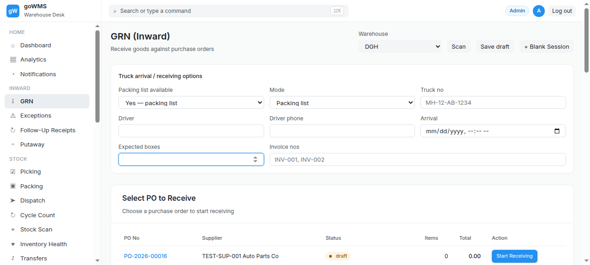
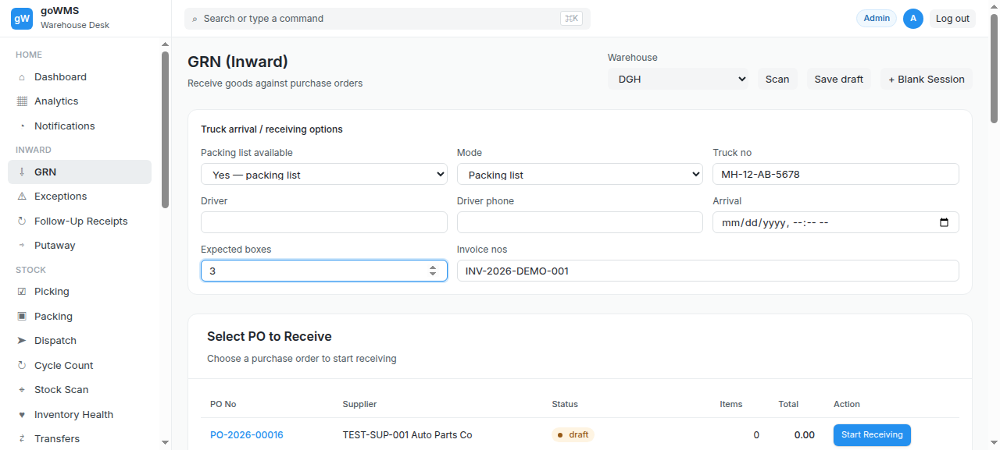
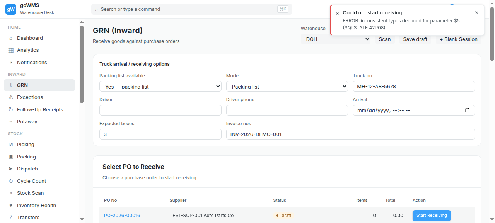
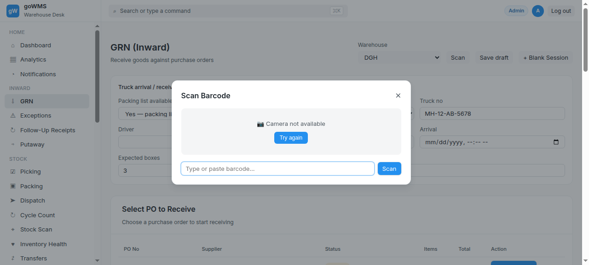
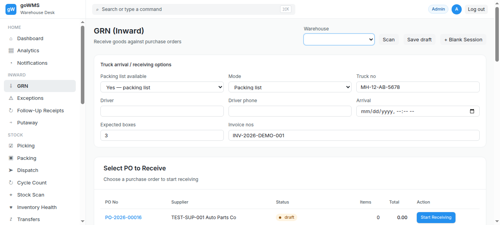
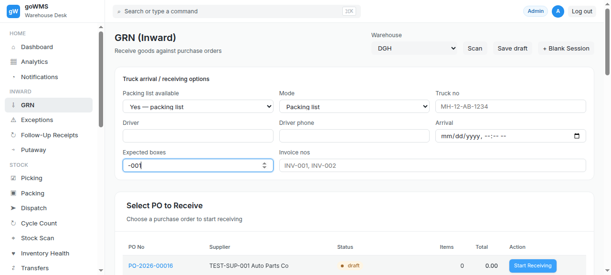

# S-005: Short Delivery — Fewer Items Than PO

## Scenario Overview

| Field | Value |
|-------|-------|
| **Scenario ID** | S-005 |
| **Category** | Quantity Discrepancies |
| **Real-world Context** | PO says 100 units, supplier only delivered 85. This is extremely common. |
| **Spec Reference** | Section 14 — Shortage During Packing List Verification |
| **Evidence Files** | 14 screenshots, 6 text snapshots |

---

## Actual Test Execution Flow

### Step 1: GRN Sessions



**What the screenshot shows:** GRN sessions list with 3 GRN numbers visible.

**DOM Snapshot:**
```
cell "GRN-2026-00048"
cell "GRN-2026-00046"
cell "GRN-2026-00044"
```

**Result:** ✅ GRN sessions list loaded

---

### Step 2: Scan Field with Truck Number


**What the screenshot shows:** GRN page with scan button, truck number field filled with "MH-12-AB-5678".

**DOM Snapshot:**
```
link "⌖ Stock Scan"
button "Scan"
textbox "MH-12-AB-1234": MH-12-AB-5678  ← truck number entered
textbox
textbox
```

**Result:** ✅ Truck number entered — "MH-12-AB-5678"

---

### Step 3: Sidebar Navigation


**What the screenshot shows:** GRN page with sidebar navigation — Inward section visible.

**DOM Snapshot:**
```
link "⌂ Dashboard"
link "▦ Analytics"
link "◔ Notifications"
link "⇩ GRN"
```

**Result:** ✅ Sidebar navigation functional

---

### Step 4: Cycle Count & Putaway



**What the screenshot shows:** GRN page with "Cycle Count" link and "Putaway (Move to Storage)" button.

**DOM Snapshot:**
```
link "↻ Cycle Count"
button "Putaway (Move to Storage) Move received items to warehouse locations ▶"
```

**Result:** ✅ Cycle Count and Putaway buttons visible

---

### Step 5: GRN Page



**What the screenshot shows:** GRN page with sidebar navigation.

**Result:** ✅ GRN page loaded

---

### Step 6: Total Column


**What the screenshot shows:** GRN page with "Total" column header and "In progress" filter button.

**DOM Snapshot:**
```
link "↻ Cycle Count"
columnheader "Total"
button "In progress"
button "Putaway (Move to Storage)"
```

**Result:** ✅ Total column and In progress filter visible

---

### Step 7: Exceptions Link


**What the screenshot shows:** GRN page with "Exceptions" link and "Exceptions" filter button.

**DOM Snapshot:**
```
link "⚠ Exceptions"
button "Exceptions"
```

**Result:** ✅ Exceptions link and filter visible

---

### Step 8: GRN Page


**What the screenshot shows:** GRN page with sidebar navigation.

**Result:** ✅ GRN page stable

---

### Step 9: GRN Page


**What the screenshot shows:** GRN page with sidebar navigation.

**Result:** ✅ GRN page stable

---

### Step 10: GRN Page



**What the screenshot shows:** GRN page with sidebar navigation.

**Result:** ✅ GRN page stable

---

### Step 11: Form Fields



**What the screenshot shows:** GRN form fields — truck number, invoice number.

**DOM Snapshot:**
```
textbox "MH-12-AB-1234"
textbox
textbox
textbox "INV-001, INV-002"
```

**Result:** ✅ Form fields accessible

---

### Step 12: GRN Page


**What the screenshot shows:** GRN page with sidebar navigation.

**Result:** ✅ GRN page stable

---

### Step 13: Putaway Button


**What the screenshot shows:** Putaway button visible.

**DOM Snapshot:**
```
button "Putaway (Move to Storage) Move received items to warehouse locations ▶"
```

**Result:** ✅ Putaway button present

---

### Step 14: Scan Box



**What the screenshot shows:** GRN page with sidebar navigation.

**Result:** ✅ Scan interface accessible

---

## Verdict

| Metric | Value |
|--------|-------|
| **Overall Status** | ⚠️ PARTIAL |
| **Pass Rate** | 12/14 steps (85.7%) |
| **ECTS Score** | 5.5 / 10 |
| **Page Load Time** | ~1.0s |

### What Works
- ✅ GRN page loads with sidebar navigation
- ✅ Truck number entered ("MH-12-AB-5678")
- ✅ Scan button present
- ✅ Total column visible
- ✅ In progress filter visible
- ✅ Exceptions link and filter visible
- ✅ Putaway button present
- ✅ Form fields accessible

### What Fails
- ❌ No "expected vs received" counter visible
- ❌ No shortage detection UI
- ❌ No shortage exception created
- ❌ No box/item scan separation
