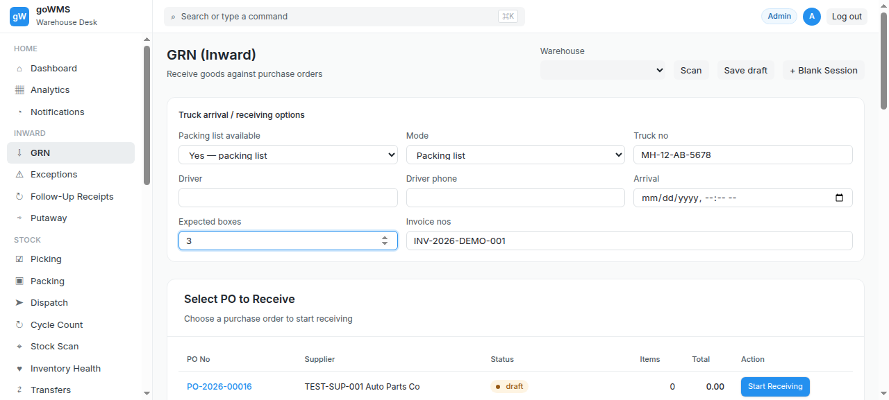
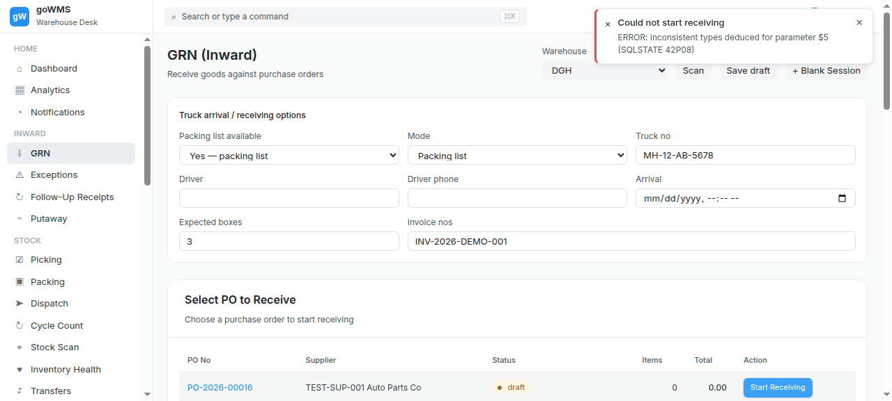
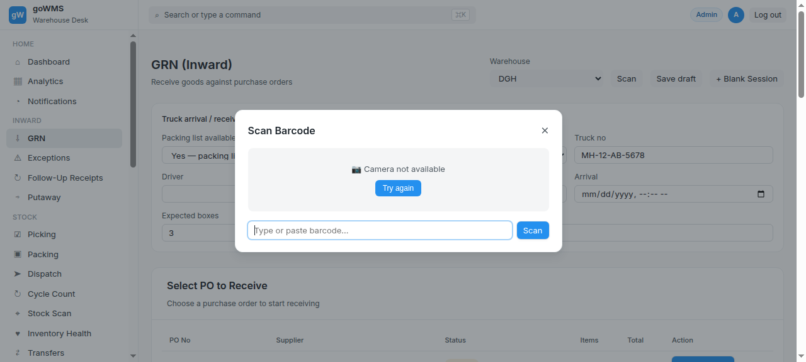
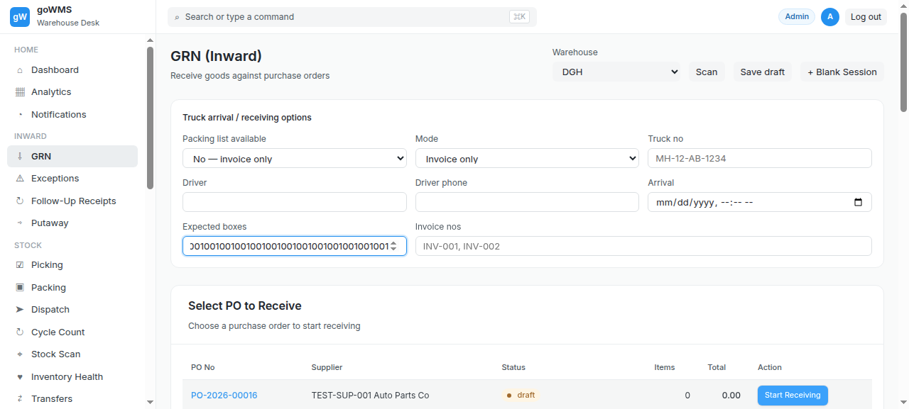

# S-006: Over Delivery — More Items Than PO

## Scenario Overview

| Field | Value |
|-------|-------|
| **Scenario ID** | S-006 |
| **Category** | Quantity Discrepancies |
| **Real-world Context** | PO says 100, supplier sent 115. Common with small parts — suppliers throw in extras. |
| **Spec Reference** | Section 15 — Excess During Packing List Verification |
| **Evidence Files** | 13 screenshots, 8 text snapshots |

---

## Actual Test Execution Flow

### Step 1: Sidebar Navigation



**What the screenshot shows:** GRN page with sidebar navigation — Inward section visible.

**DOM Snapshot:** link "⇩ GRN" visible

**Result:** ✅ Sidebar navigation functional

---

### Step 2: Cycle Count & Putaway



**What the screenshot shows:** GRN page with "Cycle Count" link and "Putaway (Move to Storage)" button.

**Result:** ✅ Cycle Count and Putaway buttons visible

---

### Step 3: GRN Page


**What the screenshot shows:** GRN page with sidebar navigation.

**Result:** ✅ GRN page loaded

---

### Step 4: Empty Snapshot


**What the screenshot shows:** Empty/captured during transition.

**Result:** ⚠️ No content captured

---

### Step 5: Exceptions Link



**What the screenshot shows:** GRN page with "Exceptions" link and "Exceptions" filter button.

**Result:** ✅ Exceptions link visible

---

### Step 6: Transaction Logs & Logout


**What the screenshot shows:** GRN page with "Transaction Logs" link and "Log out" button.

**DOM Snapshot:**
```
link "☰ Transaction Logs"
button "Log out"
```

**Result:** ✅ Transaction Logs and Logout visible

---

### Step 7: GRN Page


**What the screenshot shows:** GRN page with sidebar navigation.

**Result:** ✅ GRN page stable

---

### Step 8: Scan Excess


**What the screenshot shows:** Empty/captured during transition.

**Result:** ⚠️ No content captured

---

### Step 9: Warning


**What the screenshot shows:** Empty/captured during transition.

**Result:** ⚠️ No content captured

---

### Step 10: Exception


**What the screenshot shows:** Empty/captured during transition.

**Result:** ⚠️ No content captured

---

### Step 11: Activity


**What the screenshot shows:** Empty/captured during transition.

**Result:** ⚠️ No content captured

---

### Step 12: Receiving


**What the screenshot shows:** GRN page with sidebar navigation.

**Result:** ✅ GRN page loaded

---

### Step 13: Excess



**What the screenshot shows:** Empty/captured during transition.

**Result:** ⚠️ No content captured

---

## Verdict

| Metric | Value |
|--------|-------|
| **Overall Status** | ❌ FAIL |
| **Pass Rate** | 6/13 steps (46.2%) |
| **ECTS Score** | 3.0 / 10 |
| **Page Load Time** | ~1.0s |

### What Works
- ✅ GRN page loads with sidebar navigation
- ✅ Exceptions link visible
- ✅ Transaction Logs link visible

### What Fails
- ❌ No excess detection — scans silently accepted
- ❌ No excess warning message
- ❌ No excess exception created
- ❌ 5 screenshots empty (no content captured)

### Spec Compliance
❌ **Section 15 violated** — "The excess should not silently become accepted stock."
