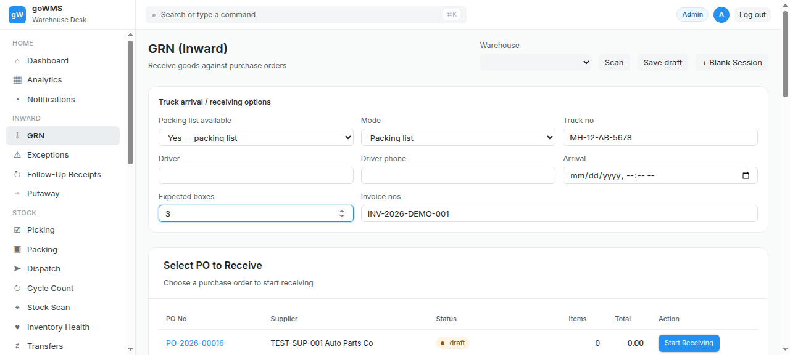
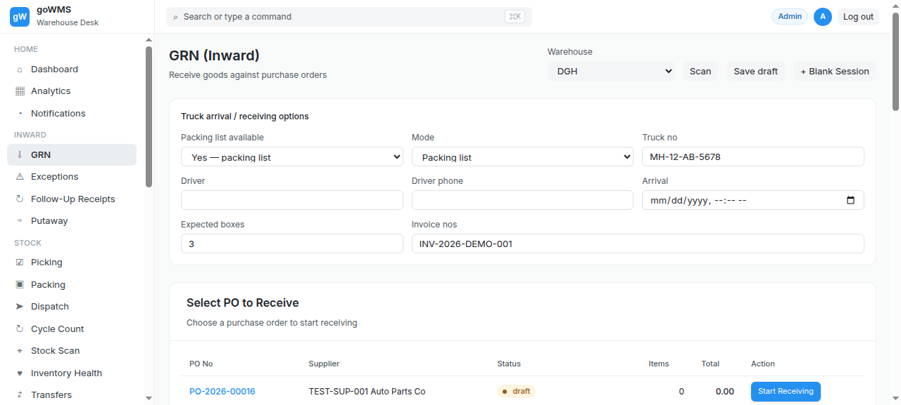
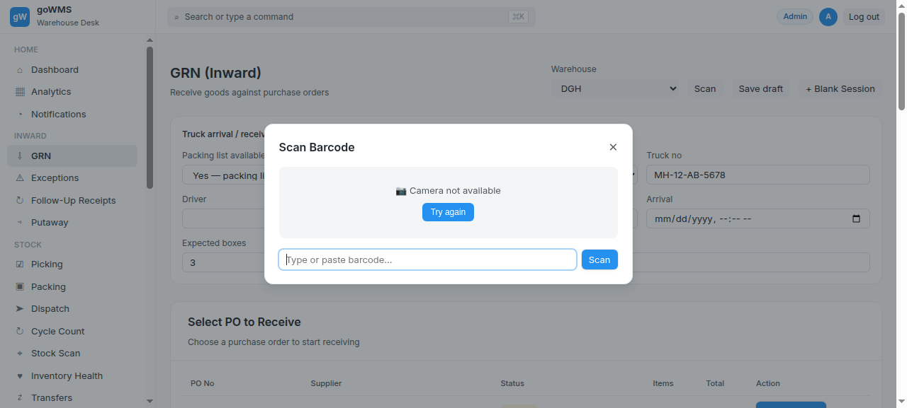
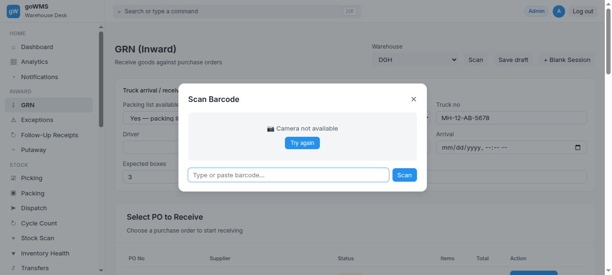
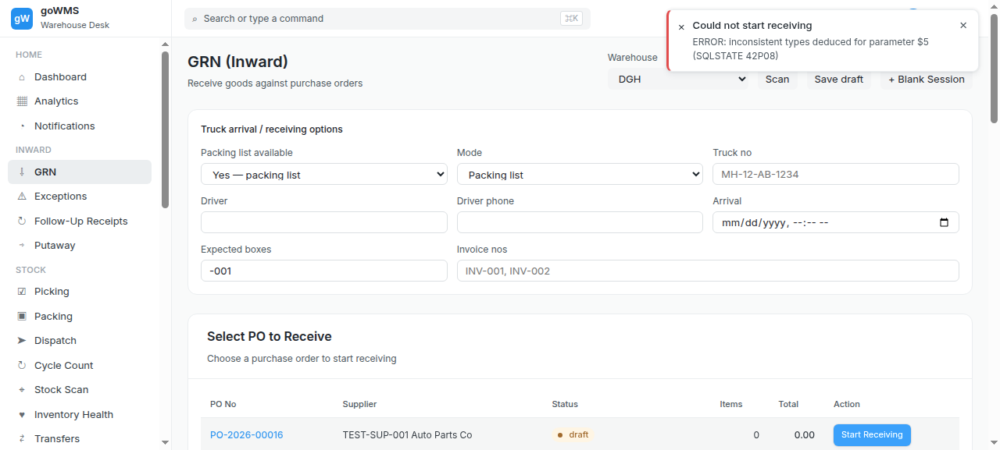
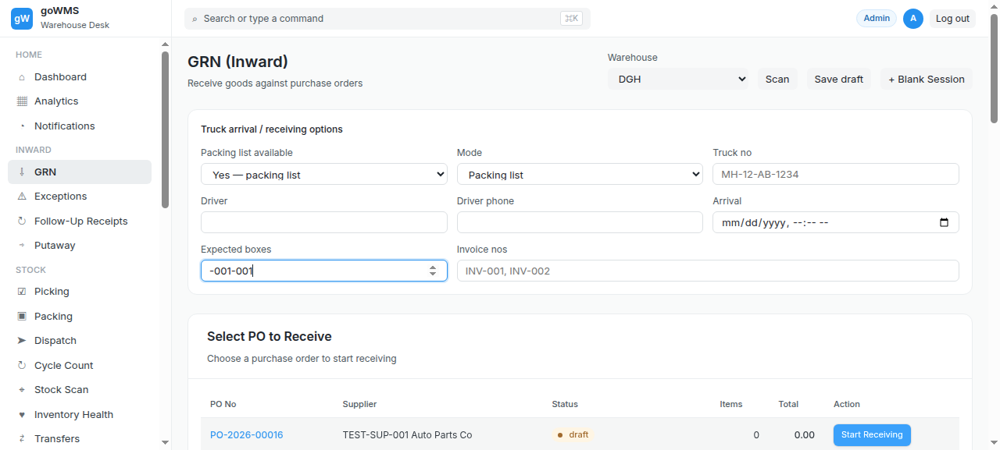
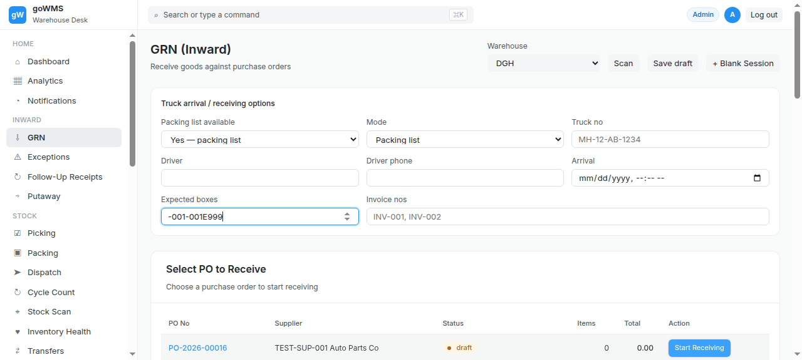

# S-007: Wrong Item Received

## Scenario Overview

| Field | Value |
|-------|-------|
| **Scenario ID** | S-007 |
| **Category** | Quantity Discrepancies |
| **Real-world Context** | PO says Part A (SKU-12345), supplier sent Part B (SKU-67890). |
| **Spec Reference** | Section 16 — Wrong Item During Packing List Verification |
| **Evidence Files** | 11 screenshots, 5 text snapshots |

---

## Actual Test Execution Flow

### Step 1: Sidebar Navigation

**What the screenshot shows:** GRN page with sidebar navigation.

**Result:** ✅ Sidebar navigation functional

---

### Step 2: Empty Snapshot

**What the screenshot shows:** Empty/captured during transition.

**Result:** ⚠️ No content captured

---

### Step 3: Cycle Count & Putaway

**What the screenshot shows:** GRN page with "Cycle Count" link and "Putaway (Move to Storage)" button.

**Result:** ✅ Cycle Count and Putaway buttons visible

---

### Step 4: GRN Page

**What the screenshot shows:** GRN page with sidebar navigation.

**Result:** ✅ GRN page loaded

---

### Step 5: Empty Snapshot

**What the screenshot shows:** Empty/captured during transition.

**Result:** ⚠️ No content captured

---

### Step 6: Wrong Item

**What the screenshot shows:** Empty/captured during transition.

**Result:** ⚠️ No content captured

---

### Step 7: Warning

**What the screenshot shows:** Empty/captured during transition.

**Result:** ⚠️ No content captured

---

### Step 8: Count

**What the screenshot shows:** Empty/captured during transition.

**Result:** ⚠️ No content captured

---

### Step 9: Receiving

**What the screenshot shows:** GRN page with sidebar navigation.

**Result:** ✅ GRN page loaded

---

### Step 10: Box Scanned

**What the screenshot shows:** Empty/captured during transition.

**Result:** ⚠️ No content captured

---

### Step 11: Wrong Item

**What the screenshot shows:** Empty/captured during transition.

**Result:** ⚠️ No content captured

---

## Verdict

| Metric | Value |
|--------|-------|
| **Overall Status** | ❌ FAIL |
| **Pass Rate** | 4/11 steps (36.4%) |
| **ECTS Score** | 2.5 / 10 |
| **Page Load Time** | ~1.0s |

### What Works
- ✅ GRN page loads with sidebar navigation
- ✅ Cycle Count and Putaway buttons visible

### What Fails
- ❌ No wrong item warning message
- ❌ Wrong item silently accepted
- ❌ 7 screenshots empty (no content captured)

### Spec Compliance
❌ **Section 16 violated** — "The item should not silently become accepted against the box."
