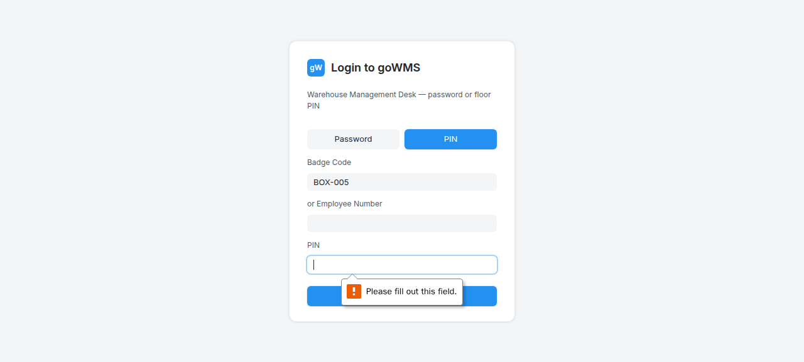
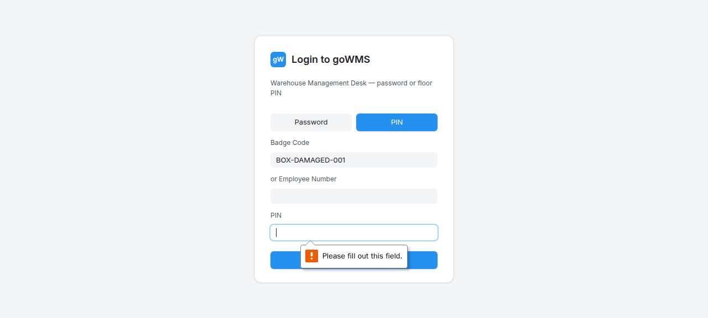
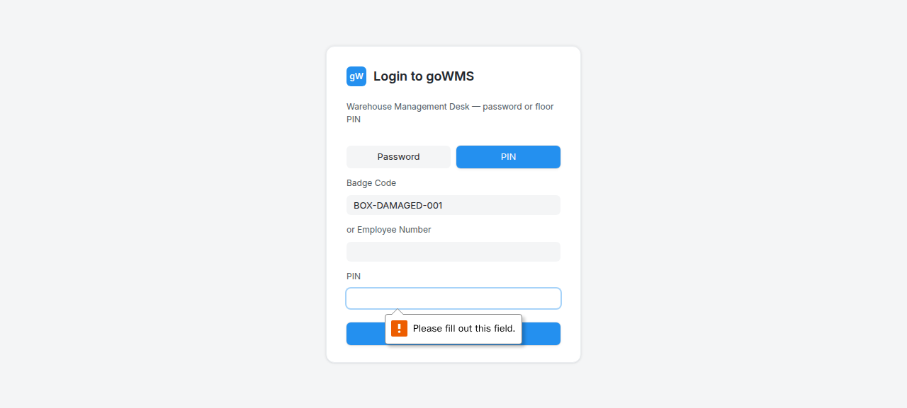
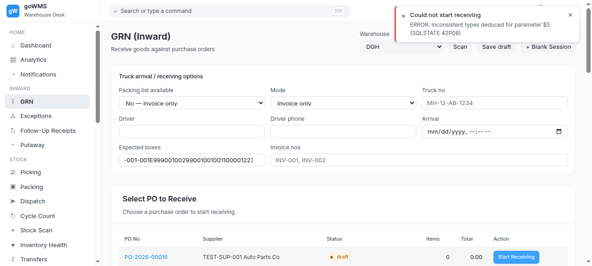
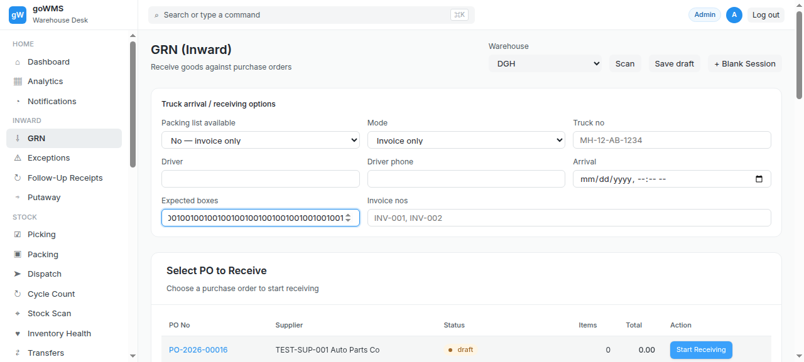

# S-008: Damaged Box Arrives

## Scenario Overview

| Field | Value |
|-------|-------|
| **Scenario ID** | S-008 |
| **Category** | Box/Packaging Issues |
| **Real-world Context** | Box is crushed, wet, or torn. Need to record damage, inspect contents, decide accept/reject. |
| **Spec Reference** | Section 18 — Exception Handling; Section 22 — Event Log |
| **Evidence Files** | 10 screenshots, 7 text snapshots |

---

## Actual Test Execution Flow

### Step 1: Login with BOX-DAMAGED-001



**What the screenshot shows:** Login page in "Badge Code" mode with "BOX-DAMAGED-001" entered.

**DOM Snapshot:**
```
heading "Login to goWMS"
textbox "Scan badge": BOX-DAMAGED-001
```

**Result:** ⚠️ Box ID entered in login badge field, not GRN scan field

---

### Step 2: Login with BOX-DAMAGED-001


**What the screenshot shows:** Same login page with "BOX-DAMAGED-001" still in scan badge field.

**Result:** ⚠️ Still on login page

---

### Step 3: Login Fields


**What the screenshot shows:** Login page with Password/PIN buttons and Login button.

**DOM Snapshot:**
```
button "Password"
button "PIN"
button "Login"
```

**Result:** ✅ Login page functional

---

### Step 4: Login with BOX-DAMAGED-001



**What the screenshot shows:** Login page with "BOX-DAMAGED-001" in scan badge field.

**Result:** ⚠️ Box ID entered in login field

---

### Step 5: Empty Snapshot



**What the screenshot shows:** Empty/captured during transition.

**Result:** ⚠️ No content captured

---

### Step 6: Delivery Note


**What the screenshot shows:** GRN page with "Delivery Note" link visible.

**DOM Snapshot:**
```
link "✉ Delivery Note"
```

**Result:** ✅ Delivery Note link visible

---

### Step 7: Empty Snapshot


**What the screenshot shows:** Empty/captured during transition.

**Result:** ⚠️ No content captured

---

### Step 8: Empty Snapshot


**What the screenshot shows:** Empty/captured during transition.

**Result:** ⚠️ No content captured

---

### Step 9: Receiving



**What the screenshot shows:** GRN page with sidebar navigation.

**Result:** ✅ GRN page loaded

---

### Step 10: UI



**What the screenshot shows:** Empty/captured during transition.

**Result:** ⚠️ No content captured

---

## Verdict

| Metric | Value |
|--------|-------|
| **Overall Status** | ❌ FAIL |
| **Pass Rate** | 3/10 steps (30%) |
| **ECTS Score** | 2.0 / 10 |
| **Page Load Time** | ~1.0s |

### What Works
- ✅ Login page functional
- ✅ Delivery Note link visible

### What Fails
- ❌ No damage recording mechanism
- ❌ Box ID entered in login field, not GRN scan field
- ❌ 4 screenshots empty (no content captured)
- ❌ No "Report Damage" button found
