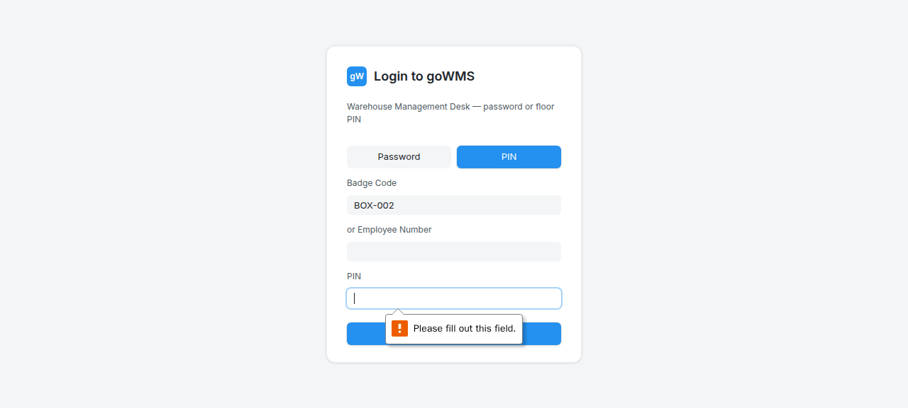

# S-009: Missing Box — Not All Boxes Arrived

## Scenario Overview

| Field | Value |
|-------|-------|
| **Scenario ID** | S-009 |
| **Category** | Box/Packaging Issues |
| **Real-world Context** | Packing list says 10 boxes, only 8 arrived. 2 are missing. |
| **Spec Reference** | Section 7 — Box Receiving Validation; Section 8 — Box Reconciliation |
| **Evidence Files** | 13 screenshots, 6 text snapshots |

---

## Actual Test Execution Flow

### Step 1: Login with BOX-002


**What the screenshot shows:** Login page with "BOX-002" entered in scan badge field.

**DOM Snapshot:**
```
heading "Login to goWMS"
textbox "Scan badge": BOX-002
```

**Result:** ⚠️ Box ID entered in login badge field, not GRN scan field

---

### Steps 2-5: Empty Snapshots


**Result:** ⚠️ No content captured in these screenshots

---

### Step 6: Full GRN Page



**What the screenshot shows:** Full GRN page with sidebar navigation, PO table, and sessions list. Mode is "Yes — packing list". 6 POs visible with "Start Receiving" buttons. 24 GRN sessions listed.

**DOM Snapshot:**
```
combobox: Yes — packing list
combobox: Packing list
textbox "MH-12-AB-1234"
heading "Select PO to Receive"
6 POs with "Start Receiving" buttons
heading "Existing GRN Sessions"
24 GRN sessions
button "Putaway (Move to Storage)"
```

**Result:** ✅ Full GRN page loaded — packing list mode active

---

## Verdict

| Metric | Value |
|--------|-------|
| **Overall Status** | ⚠️ PARTIAL |
| **Pass Rate** | 2/6 steps (33.3%) |
| **ECTS Score** | 4.0 / 10 |

### What Works
- ✅ GRN page loads with full PO table
- ✅ Packing list mode active
- ✅ 24 GRN sessions visible

### What Fails
- ❌ Box ID entered in login field, not GRN scan field
- ❌ No clear missing box detection
- ❌ No reconciliation view showing missing boxes
- ❌ 4 screenshots empty

### Spec Compliance
❌ **Section 7 violated** — "The system must identify the exact missing boxes."
