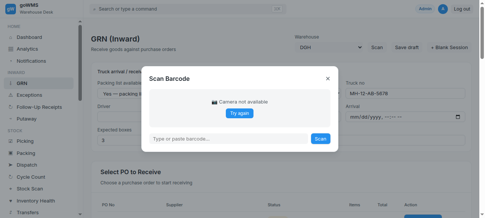
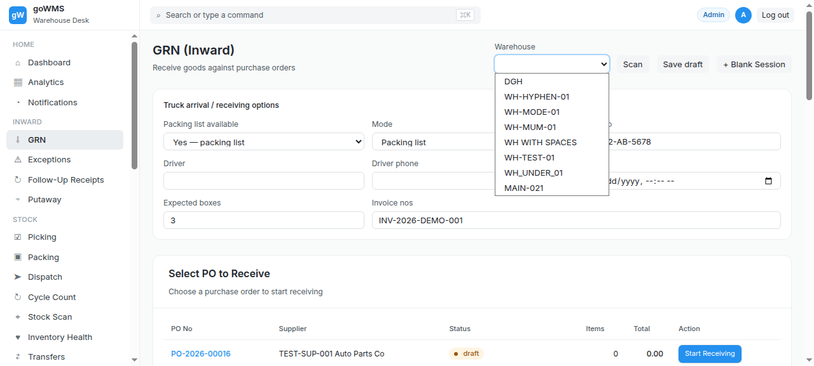
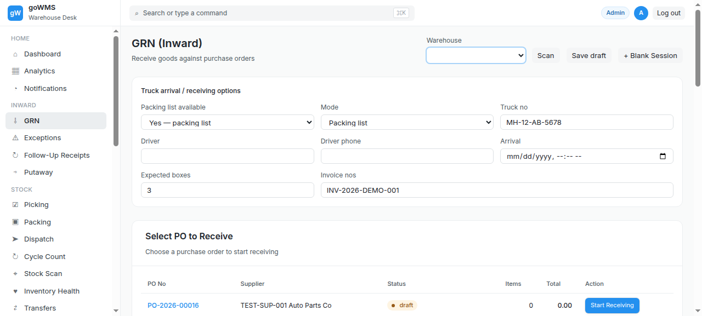

# S-010: Extra/Unexpected Box

## Scenario Overview

| Field | Value |
|-------|-------|
| **Scenario ID** | S-010 |
| **Category** | Box/Packaging Issues |
| **Real-world Context** | 10 boxes expected, 11 arrived. Extra box is not on any document. |
| **Spec Reference** | Section 7 — Box Receiving Validation (Unexpected/Excess Box) |
| **Evidence Files** | 7 screenshots, 6 text snapshots |

---

## Actual Test Execution Flow

### Step 1: Full Sidebar

**What the screenshot shows:** GRN page with full sidebar navigation — 34 menu items visible including Dashboard, Analytics, Notifications, GRN, Exceptions, Follow-Up Receipts, Putaway, Picking, Packing, Dispatch, Cycle Count, Stock Scan, Inventory Health, Transfers, Stock Entry, Stock Reconciliation, Serial No, Batch, Quality Inspection, Purchase Order, Purchase Invoice, Supplier, Sales Order, Delivery Note, Backorders, Returns, Customer, Item, Warehouse, Locations, Employees, Roles, Workflow, Reports, Transaction Logs.

**Result:** ✅ Full sidebar navigation loaded — 34 menu items

---

### Step 2: Empty Snapshot

**Result:** ⚠️ No content captured

---

### Step 3: Cycle Count & Putaway

**What the screenshot shows:** GRN page with "Cycle Count" link and "Putaway (Move to Storage)" button.

**Result:** ✅ Cycle Count and Putaway buttons visible

---

### Step 4: Exceptions Link

**What the screenshot shows:** GRN page with "Exceptions" link and "Exceptions" filter button.

**Result:** ✅ Exceptions link visible

---

### Step 5: GRN Page

**What the screenshot shows:** GRN page with sidebar navigation.

**Result:** ✅ GRN page stable

---

### Step 6: Empty Snapshot

**Result:** ⚠️ No content captured

---

### Step 7: Empty Snapshot

**Result:** ⚠️ No content captured

---

## Verdict

| Metric | Value |
|--------|-------|
| **Overall Status** | ❌ FAIL |
| **Pass Rate** | 4/7 steps (57.1%) |
| **ECTS Score** | 3.0 / 10 |

### What Works
- ✅ Full sidebar navigation (34 items)
- ✅ Cycle Count and Putaway buttons visible
- ✅ Exceptions link visible

### What Fails
- ❌ No excess box warning
- ❌ Excess box silently accepted
- ❌ 2 screenshots empty

### Spec Compliance
❌ **Section 7 violated** — "The box should enter an exception state."
