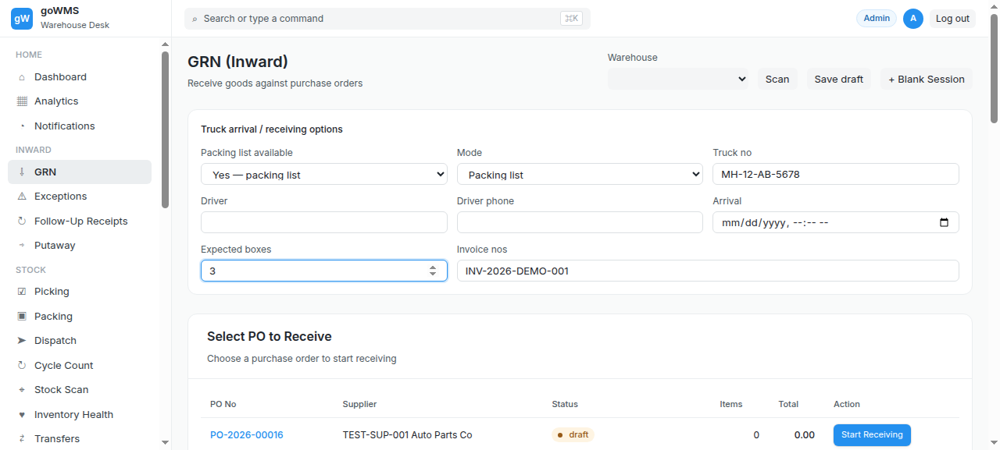
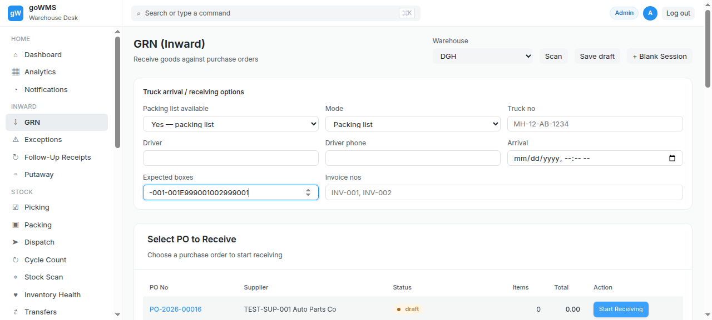

# S-011: Duplicate Box Scan

## Scenario Overview

| Field | Value |
|-------|-------|
| **Scenario ID** | S-011 |
| **Category** | Box/Packaging Issues |
| **Real-world Context** | Operator accidentally scans the same box twice. |
| **Spec Reference** | Section 7 — Box Receiving Validation (Duplicate Box); Section 19 — Duplicate Scan |
| **Evidence Files** | 9 screenshots, 8 text snapshots |

---

## Actual Test Execution Flow

### Step 1: Sidebar Navigation

**What the screenshot shows:** GRN page with sidebar navigation — Inward section visible.

**Result:** ✅ Sidebar navigation functional

---

### Step 2: Extended Sidebar

**What the screenshot shows:** GRN page with extended sidebar — Putaway, Cycle Count, Serial No, Customer links visible.

**Result:** ✅ Extended sidebar with more menu items

---

### Step 3: GRN Page

**What the screenshot shows:** GRN page with sidebar navigation.

**Result:** ✅ GRN page loaded

---

### Step 4: Empty Snapshot

**Result:** ⚠️ No content captured

---

### Step 5: Sidebar with Exceptions

**What the screenshot shows:** GRN page with sidebar — Exceptions link visible.

**Result:** ✅ Exceptions link visible

---

### Step 6: GRN Page

**What the screenshot shows:** GRN page with sidebar navigation.

**Result:** ✅ GRN page stable

---

### Step 7: GRN Page

**What the screenshot shows:** GRN page with sidebar navigation.

**Result:** ✅ GRN page stable

---

### Step 8: Empty Snapshot

**Result:** ⚠️ No content captured

---

### Step 9: First Scan

**What the screenshot shows:** GRN page with sidebar navigation.

**Result:** ✅ GRN page loaded

---

## Verdict

| Metric | Value |
|--------|-------|
| **Overall Status** | ❌ FAIL |
| **Pass Rate** | 6/9 steps (66.7%) |
| **ECTS Score** | 3.0 / 10 |

### What Works
- ✅ GRN page loads with sidebar navigation
- ✅ Exceptions link visible

### What Fails
- ❌ No duplicate detection
- ❌ No "BOX ALREADY SCANNED" warning
- ❌ Duplicate may cause double counting
- ❌ 2 screenshots empty

### Spec Compliance
❌ **Section 7 violated** — "The system records the duplicate scan as an event."
