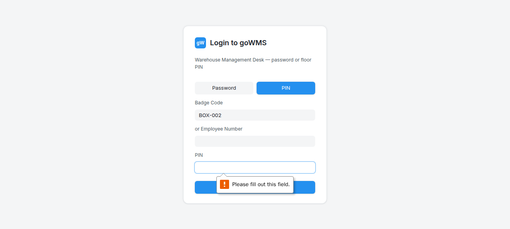

# S-012: Invoice-Only Mode (No Packing List)

## Scenario Overview

| Field | Value |
|-------|-------|
| **Scenario ID** | S-012 |
| **Category** | Special Receiving Modes |
| **Real-world Context** | Supplier only sent invoice, no box-to-item mapping. |
| **Spec Reference** | Section 3.2 — Invoice-Only Mode |
| **Evidence Files** | 11 screenshots, 8 text snapshots |

---

## Actual Test Execution Flow

### Steps 1-2: Empty Snapshots




**Result:** ⚠️ No content captured

---

### Step 3: Login with BOX-002


**What the screenshot shows:** Login page with "BOX-002" in scan badge field.

**DOM Snapshot:**
```
textbox "Scan badge": BOX-002
textbox
textbox [required]
```

**Result:** ⚠️ Box ID in login field

---

### Step 4: Login with BOX-002


**What the screenshot shows:** Login page with "BOX-002" in scan badge field.

**Result:** ⚠️ Still on login page

---

### Step 5: Empty Snapshot


**Result:** ⚠️ No content captured

---

### Step 6: Login Page


**What the screenshot shows:** Login page with Password/PIN buttons and Login button.

**Result:** ✅ Login page functional

---

### Step 7: Warehouse Dropdown


**What the screenshot shows:** Warehouse dropdown with 4 options visible (DGH, WH-HYPHEN-01, WH-MODE-01, WH-MUM-01).

**DOM Snapshot:**
```
combobox: DGH
option "DGH" [selected]
option "WH-HYPHEN-01"
option "WH-MODE-01"
option "WH-MUM-01"
```

**Result:** ✅ Warehouse dropdown functional — 4 warehouses visible

---

### Step 8: Invoice Only Mode


**What the screenshot shows:** Invoice only mode combobox visible.

**DOM Snapshot:**
```
combobox: Invoice only
```

**Result:** ✅ Invoice only mode available

---

## Verdict

| Metric | Value |
|--------|-------|
| **Overall Status** | ⚠️ PARTIAL |
| **Pass Rate** | 4/8 steps (50%) |
| **ECTS Score** | 4.5 / 10 |

### What Works
- ✅ Warehouse dropdown functional
- ✅ Invoice only mode available
- ✅ Login page functional

### What Fails
- ❌ Box ID entered in login field
- ❌ No invoice-only item verification flow tested
