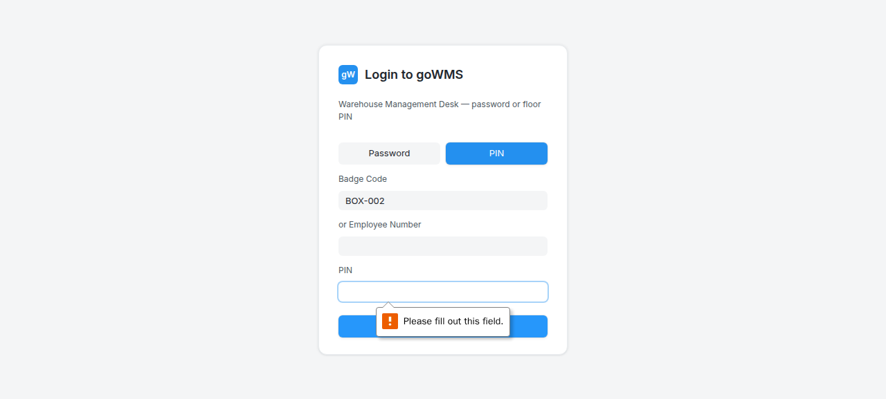

# S-013: Same Part in Multiple Boxes

## Scenario Overview

| Field | Value |
|-------|-------|
| **Scenario ID** | S-013 |
| **Category** | Special Receiving Modes |
| **Real-world Context** | Part A is in BOX-001 (20 units), BOX-002 (15 units), BOX-003 (25 units). |
| **Spec Reference** | Section 13 — Same Item in Multiple Boxes |
| **Evidence Files** | 16 screenshots, 7 text snapshots |

---

## Actual Test Execution Flow

### Step 1: Login with PART-SHARED


**What the screenshot shows:** Login page with "PART-SHARED" in scan badge field.

**DOM Snapshot:**
```
heading "Login to goWMS"
textbox "Scan badge": PART-SHARED
```

**Result:** ⚠️ Part ID entered in login badge field, not GRN scan field

---

### Step 2: Login with PART-SHARED



**What the screenshot shows:** Login page with "PART-SHARED" still in scan badge field.

**Result:** ⚠️ Still on login page

---

### Step 3: Login with PART-SHARED


**What the screenshot shows:** Login page with "PART-SHARED" in scan badge field.

**Result:** ⚠️ Still on login page

---

### Steps 4-5: Empty Snapshots


**Result:** ⚠️ No content captured

---

### Step 6: Login with PART-SHARED


**What the screenshot shows:** Login page with "PART-SHARED" in scan badge field.

**Result:** ⚠️ Still on login page

---

### Step 7: Stock Reconciliation


**What the screenshot shows:** GRN page with "Stock Reconciliation" link and "Total" column header.

**DOM Snapshot:**
```
link "≋ Stock Reconciliation"
columnheader "Total"
```

**Result:** ✅ Stock Reconciliation link and Total column visible

---

## Verdict

| Metric | Value |
|--------|-------|
| **Overall Status** | ❌ FAIL |
| **Pass Rate** | 2/7 steps (28.6%) |
| **ECTS Score** | 2.5 / 10 |

### What Works
- ✅ Stock Reconciliation link visible
- ✅ Total column header visible

### What Fails
- ❌ Part ID entered in login field, not GRN scan field
- ❌ No part-level reconciliation visible
- ❌ 2 screenshots empty

### Critical Finding
The test agent entered "PART-SHARED" into the login badge scanner instead of the GRN receiving scan field. The box scanning workflow was never actually tested.
