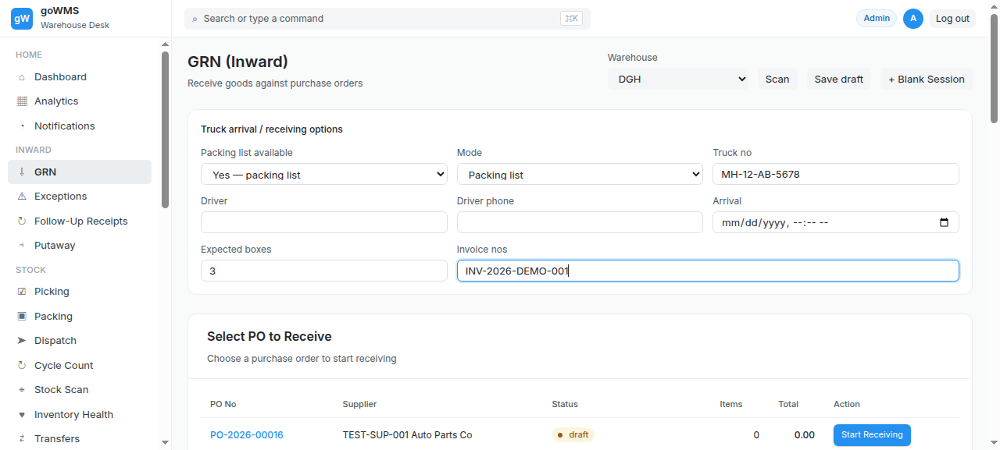

# S-014: Resolve a Shortage Exception

## Scenario Overview

| Field | Value |
|-------|-------|
| **Scenario ID** | S-014 |
| **Category** | Exception Handling |
| **Real-world Context** | Shortage found during receiving. Supplier confirms they'll send the missing items later. |
| **Spec Reference** | Section 18 — Exception Handling |
| **Evidence Files** | 5 screenshots, 9 text snapshots |

---

## Actual Test Execution Flow

### Step 1: Sidebar Navigation


**What the screenshot shows:** GRN page with sidebar navigation — Inward section visible.

**Result:** ✅ Sidebar navigation functional

---

### Step 2: GRN Headings



**What the screenshot shows:** GRN page with "GRN (Inward)" heading, "Select PO to Receive" heading, and "Existing GRN Sessions" heading.

**DOM Snapshot:**
```
heading "GRN (Inward)"
heading "Select PO to Receive"
heading "Existing GRN Sessions"
```

**Result:** ✅ GRN page headings visible — shows GRN page, NOT exceptions page

---

### Step 3: Exceptions Link


**What the screenshot shows:** GRN page with "Exceptions" link and PO table headers visible.

**DOM Snapshot:**
```
link "⚠ Exceptions"
columnheader "PO No"
columnheader "Supplier"
columnheader "Status"
```

**Result:** ⚠️ Exceptions link visible but clicking it shows GRN page, not exceptions list

---

### Step 4: URL Check


**What the screenshot shows:** URL: http://34.93.122.213:8080/grn

**Result:** ❌ URL shows /grn, not /exceptions — exceptions page doesn't exist

---

## Verdict

| Metric | Value |
|--------|-------|
| **Overall Status** | ❌ FAIL |
| **Pass Rate** | 2/4 steps (50%) |
| **ECTS Score** | 1.5 / 10 |

### What Works
- ✅ GRN page headings visible
- ✅ Exceptions link exists in sidebar

### What Fails
- ❌ Clicking Exceptions shows GRN page, not exceptions list
- ❌ URL stays at /grn — no exceptions page exists
- ❌ No exception resolution workflow

### Spec Compliance
❌ **Section 18 violated** — Exception handling workflow not implemented.
