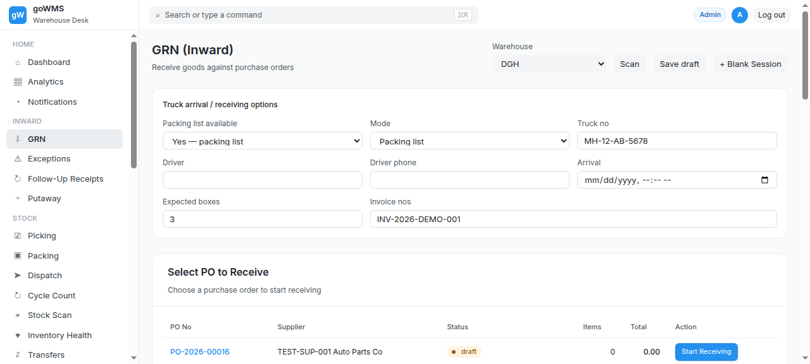
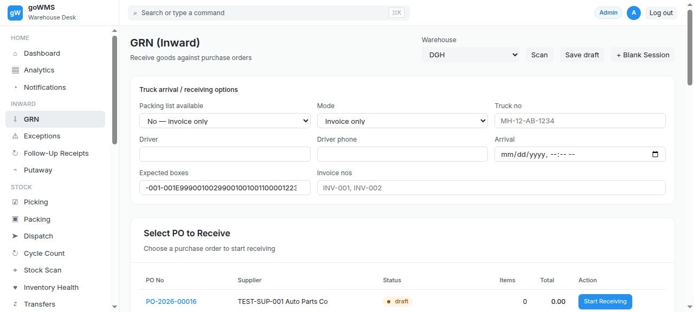

# S-015: Follow-Up Receipt for Missing Material

## Scenario Overview

| Field | Value |
|-------|-------|
| **Scenario ID** | S-015 |
| **Category** | Exception Handling |
| **Real-world Context** | Original GRN had 20 units short. Supplier delivers the 20 units a week later. |
| **Spec Reference** | Section 21 — Follow-Up Receipt |
| **Evidence Files** | 4 screenshots, 7 text snapshots |

---

## Actual Test Execution Flow

### Step 1: Sidebar Navigation



**What the screenshot shows:** GRN page with sidebar navigation — Inward section visible.

**Result:** ✅ Sidebar navigation functional

---

### Step 2: GRN Headings


**What the screenshot shows:** GRN page with "GRN (Inward)" heading, "Select PO to Receive" heading, and "Existing GRN Sessions" heading.

**Result:** ✅ GRN page headings visible — shows GRN page, NOT follow-up page

---

### Step 3: URL Check



**What the screenshot shows:** URL: http://34.93.122.213:8080/grn

**Result:** ❌ URL shows /grn, not /follow-up — follow-up page doesn't exist

---

### Step 4: Follow-Up Receipts Link


**What the screenshot shows:** GRN page with "Follow-Up Receipts" link visible in sidebar.

**DOM Snapshot:**
```
link "↻ Follow-Up Receipts"
button "Log out"
heading "GRN (Inward)"
button "Scan"
```

**Result:** ⚠️ Follow-Up Receipts link exists but clicking it shows GRN page

---

## Verdict

| Metric | Value |
|--------|-------|
| **Overall Status** | ❌ FAIL |
| **Pass Rate** | 1/4 steps (25%) |
| **ECTS Score** | 1.0 / 10 |

### What Works
- ✅ Follow-Up Receipts link exists in sidebar

### What Fails
- ❌ Clicking Follow-Up Receipts shows GRN page, not follow-up list
- ❌ URL stays at /grn — no follow-up page exists
- ❌ No follow-up receipt workflow

### Spec Compliance
❌ **Section 21 violated** — "This maintains a continuous history rather than creating an unrelated receipt."
