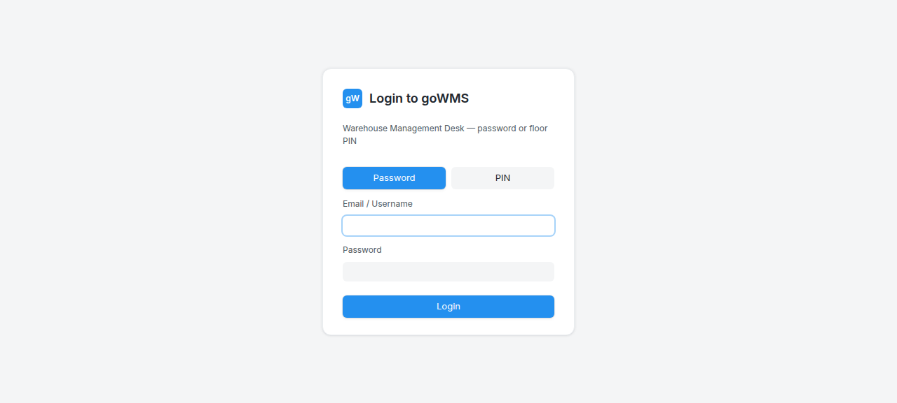

# S-016: Random Audit After Receiving

## Scenario Overview

| Field | Value |
|-------|-------|
| **Scenario ID** | S-016 |
| **Category** | Audit |
| **Real-world Context** | Supervisor wants to verify physical counts match system. |
| **Spec Reference** | Section 20 — Audit |
| **Evidence Files** | 8 screenshots, 8 text snapshots |

---

## Actual Test Execution Flow

### Steps 1-2: Empty Snapshots

**Result:** ⚠️ No content captured

---

### Step 3: Login Page

**What the screenshot shows:** Login page with Password/PIN buttons and Login button.

**Result:** ✅ Login page functional

---

### Step 4: Empty Snapshot

**Result:** ⚠️ No content captured

---

### Step 5: Login Page

**What the screenshot shows:** Login page with "Login to goWMS" heading.

**Result:** ⚠️ Agent was on login page, not GRN detail

---

### Step 6: URL Check

**What the screenshot shows:** URL: http://34.93.122.213:8080/login

**Result:** ❌ URL shows /login — agent was on login page

---

### Step 7: Sidebar Navigation

**What the screenshot shows:** GRN page with sidebar navigation.

**Result:** ✅ GRN page loaded after login

---

### Step 8: Empty Snapshot

**Result:** ⚠️ No content captured

---

## Verdict

| Metric | Value |
|--------|-------|
| **Overall Status** | ❌ FAIL |
| **Pass Rate** | 2/8 steps (25%) |
| **ECTS Score** | 1.5 / 10 |

### What Works
- ✅ Login page functional
- ✅ GRN page loads after login

### What Fails
- ❌ No audit tab/function found
- ❌ Agent was on login page during most of the test
- ❌ 4 screenshots empty

### Spec Compliance
❌ **Section 20 violated** — "An audit option should be available."
