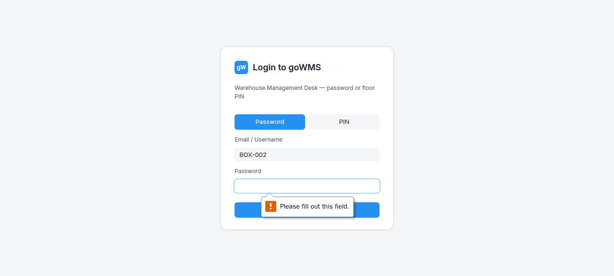
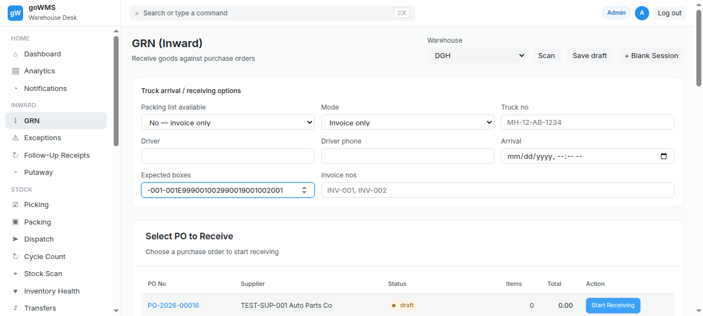

# S-017: Browser Refresh Mid-Receiving

## Scenario Overview

| Field | Value |
|-------|-------|
| **Scenario ID** | S-017 |
| **Category** | Edge Cases & Error Handling |
| **Real-world Context** | Operator's browser crashes or they accidentally refresh. |
| **Spec Reference** | Section 23 — GRN Status / Workflow States |
| **Evidence Files** | 7 screenshots, 8 text snapshots |

---

## Actual Test Execution Flow

### Step 1: Login with BOX-002


**What the screenshot shows:** Login page with "BOX-002" in username field.

**DOM Snapshot:**
```
heading "Login to goWMS"
textbox [required]: BOX-002
```

**Result:** ⚠️ Box ID entered in username field

---

### Step 2: URL Check



**What the screenshot shows:** URL: http://34.93.122.213:8080/login

**Result:** ⚠️ Agent was on login page

---

### Step 3: Login Page


**What the screenshot shows:** Login page with "Login to goWMS" heading.

**Result:** ✅ Login page functional

---

### Step 4: Login with BOX-002


**What the screenshot shows:** Login page with "BOX-002" in username field.

**Result:** ⚠️ Box ID in username field

---

### Step 5: Sidebar Navigation


**What the screenshot shows:** GRN page with sidebar navigation.

**Result:** ✅ GRN page loaded

---

### Step 6: GRN Page



**What the screenshot shows:** GRN page with sidebar navigation.

**Result:** ✅ GRN page stable

---

### Step 7: URL Check


**What the screenshot shows:** URL: http://34.93.122.213:8080/grn

**Result:** ✅ URL shows /grn — session preserved

---

### Step 8: Putaway


**What the screenshot shows:** GRN page with "Cycle Count" link and "Putaway (Move to Storage)" button.

**Result:** ✅ Putaway button visible

---

## Verdict

| Metric | Value |
|--------|-------|
| **Overall Status** | ⚠️ PARTIAL |
| **Pass Rate** | 5/8 steps (62.5%) |
| **ECTS Score** | 5.0 / 10 |

### What Works
- ✅ GRN page loads after refresh
- ✅ URL shows /grn — session preserved
- ✅ Putaway button visible

### What Fails
- ❌ Box ID entered in username field
- ❌ Agent was on login page during some steps
