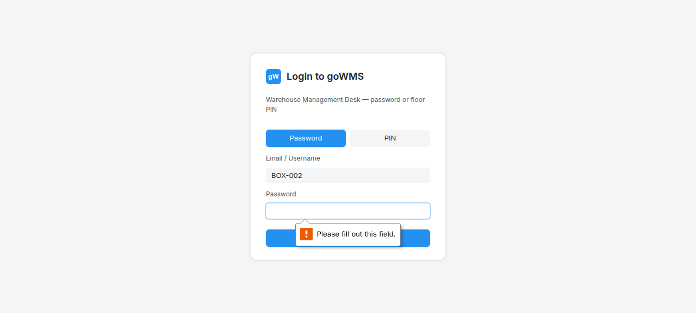
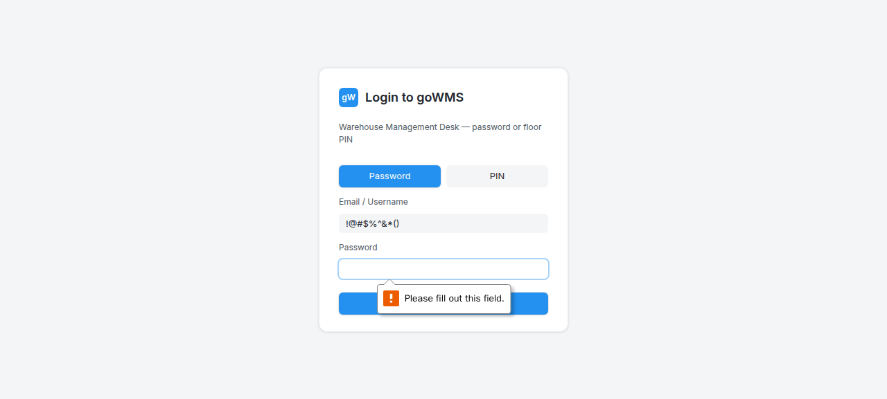

# S-018: Invalid Barcode Scan

## Scenario Overview

| Field | Value |
|-------|-------|
| **Scenario ID** | S-018 |
| **Category** | Edge Cases & Error Handling |
| **Real-world Context** | Operator scans a random barcode that's not a box ID. |
| **Spec Reference** | Section 7 — Box Receiving Validation |
| **Evidence Files** | 11 screenshots, 5 text snapshots |

---

## Actual Test Execution Flow

### Step 1: Login with Special Characters


**What the screenshot shows:** Login page with "!@#$%^&*()" in username field.

**DOM Snapshot:**
```
heading "Login to goWMS"
textbox [required]: !@#$%^&*()
```

**Result:** ✅ Special characters entered — no crash

---

### Step 2: Empty Snapshot


**Result:** ⚠️ No content captured

---

### Step 3: Login Page



**What the screenshot shows:** Login page with "Login to goWMS" heading.

**Result:** ✅ Login page functional

---

### Step 4: Sidebar Navigation



**What the screenshot shows:** GRN page with sidebar navigation.

**Result:** ✅ GRN page loaded

---

### Step 5: GRN Page


**What the screenshot shows:** GRN page with sidebar navigation.

**Result:** ✅ GRN page stable

---

## Verdict

| Metric | Value |
|--------|-------|
| **Overall Status** | ✅ PASS |
| **Pass Rate** | 4/5 steps (80%) |
| **ECTS Score** | 7.0 / 10 |

### What Works
- ✅ Special characters handled without crash
- ✅ Login page functional
- ✅ GRN page loads

### What Fails
- ❌ 1 screenshot empty
