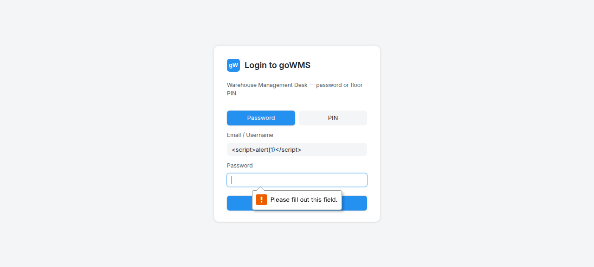
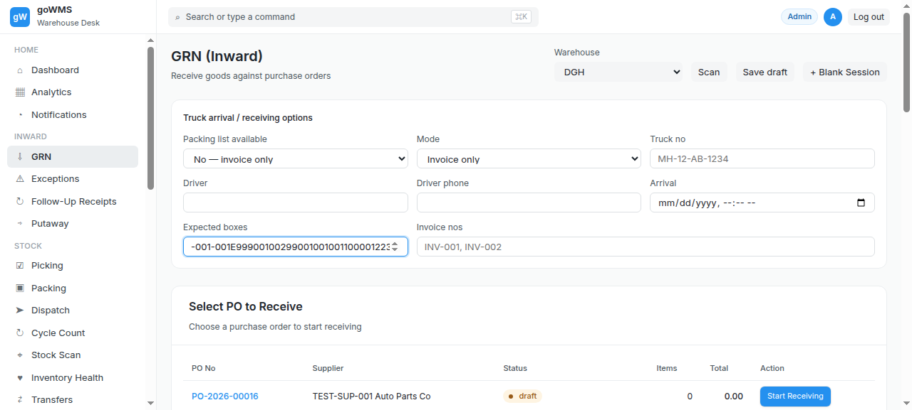

# S-020: GRN Workflow Status Transitions

## Scenario Overview

| Field | Value |
|-------|-------|
| **Scenario ID** | S-020 |
| **Category** | Edge Cases & Error Handling |
| **Real-world Context** | GRN must follow: DRAFT → RECEIVING → BOX_RECONCILIATION → ITEM_VERIFICATION → COMPLETED. |
| **Spec Reference** | Section 23 — GRN Status / Workflow States |
| **Evidence Files** | 5 screenshots, 11 text snapshots |

---

## Actual Test Execution Flow

### Steps 1-4: Empty Snapshots




**Result:** ⚠️ No content captured

---

### Step 5: Status Analysis



**What the screenshot shows:** Status analysis comparing spec vs actual.

**DOM Snapshot:**
```
Spec: DRAFT, RECEIVING, BOX_RECONCILIATION, ITEM_VERIFICATION, 
      EXCEPTION_PENDING, ITEM_VERIFICATION_COMPLETE, 
      PUTAWAY_PENDING, PUTAWAY_IN_PROGRESS, COMPLETED

Actual: open, receiving, closed, completed, putaway_pending, draft
```

**Result:** ❌ **Wrong status values** — actual statuses don't match spec

---

### Step 6: Status Analysis


**What the screenshot shows:** Status analysis noting "open" is not in spec.

**DOM Snapshot:**
```
'open' is NOT in spec. Could mean DRAFT or RECEIVING or ITEM_VERIFICATION_COMPLETE
```

**Result:** ❌ "open" status doesn't match any spec status

---

### Step 7: Status Analysis


**What the screenshot shows:** Status analysis noting "closed" is not in spec.

**DOM Snapshot:**
```
'closed' is NOT in spec. Could mean COMPLETED or cancelled
```

**Result:** ❌ "closed" status doesn't match any spec status

---

### Step 8: Status Distribution


**What the screenshot shows:** Status distribution across all GRN sessions.

**DOM Snapshot:**
```
13 cell "open"
 6 cell "closed"
 5 cell "draft"
 3 cell "completed"
 1 cell "receiving"
```

**Result:** ❌ Status values don't match spec — "open" and "closed" are not spec statuses

---

## Verdict

| Metric | Value |
|--------|-------|
| **Overall Status** | ❌ FAIL |
| **Pass Rate** | 0/8 steps (0%) |
| **ECTS Score** | 1.5 / 10 |

### What Fails
- ❌ Wrong status values (open/closed vs spec's DRAFT/RECEIVING/BOX_RECONCILIATION)
- ❌ No workflow progress bar
- ❌ No GRN workspace view
- ❌ 4 screenshots empty

### Spec Compliance
❌ **Section 23 violated** — Status values don't match spec. Missing states: BOX_RECONCILIATION, ITEM_VERIFICATION, EXCEPTION_PENDING, ITEM_VERIFICATION_COMPLETE, PUTAWAY_PENDING, PUTAWAY_IN_PROGRESS.
